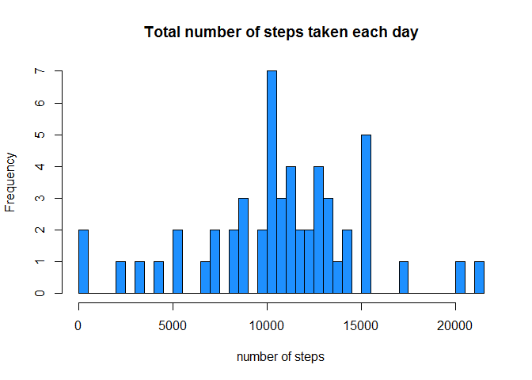
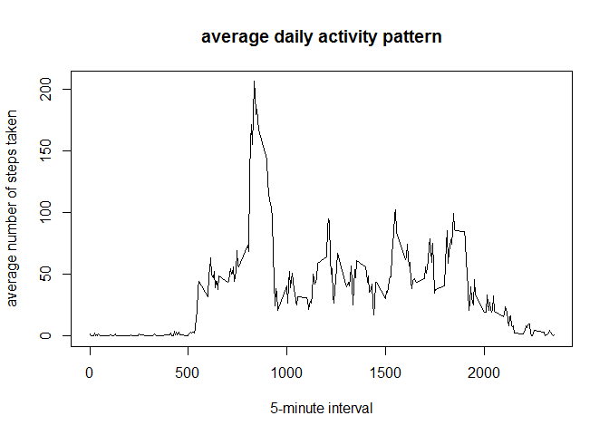
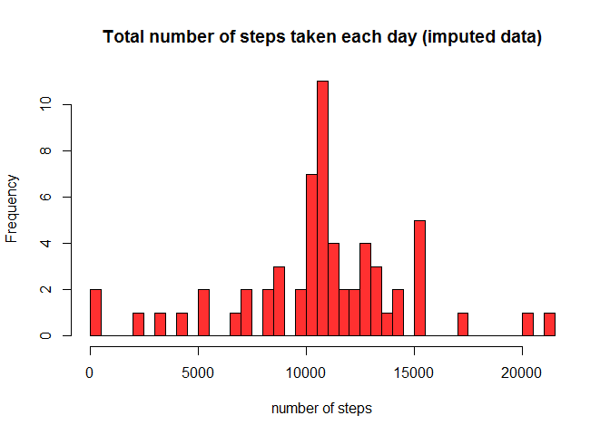
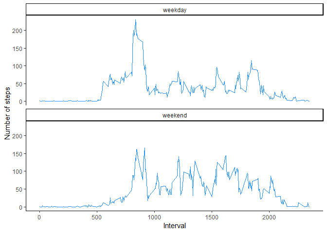

---
title: "Reproducible Research: Peer Assessment 1"
output: 
  html_document:
    keep_md: true
---


## Loading and preprocessing the data

For this part of the assignment, we read the relevant data file.


```r
suppressMessages(library(lubridate))
unzip("activity.zip")
act<-read.csv("activity.csv")
act$date <- ymd(act$date)
```


## What is the mean total number of steps taken per day?

To answer that, we first plot the frequency histogram of the total number of steps taken each day and consecutively we report its mean and median.


```r
total.per.day<-aggregate(steps ~ date, act, sum)
hist(total.per.day$steps, breaks=53, main="Total number of steps taken each day", xlab="number of steps", col="dodgerblue")
```

<!-- -->

```r
cat("Reporting the mean of the total number of steps taken per day: ", mean(total.per.day$steps))
```

```
## Reporting the mean of the total number of steps taken per day:  10766.19
```

```r
cat("Reporting the median of the total number of steps taken per day: ", median(total.per.day$steps))
```

```
## Reporting the median of the total number of steps taken per day:  10765
```


## What is the average daily activity pattern?

The average daily activity pattern is given from a time-series plot:


```r
time.series<-aggregate(steps ~ interval, act, mean)
plot(time.series, type="l",xlab="5-minute interval", ylab="average number of steps taken", main="average daily activity pattern")
```

<!-- -->

```r
cat("Which 5-minute interval, on average across all the days in the dataset, contains the maximum number of steps?  Answer: ", time.series$interval[time.series$steps==max(time.series$steps)])
```

```
## Which 5-minute interval, on average across all the days in the dataset, contains the maximum number of steps?  Answer:  835
```


## Imputing missing values

In this part of the assignment we calculate our missing step numbers (missing observations) and fill them in by the average over all days for the given 5-minute interval. That gives us a new dataset with imputed values that we then compare to the old one.


```r
cat("Reporting the total number of missing values in the dataset:  ", sum(!complete.cases(act)))
```

```
## Reporting the total number of missing values in the dataset:   2304
```

```r
new.act<-act
average.interval<-tapply(act$steps, act$interval, mean, na.rm=TRUE)
missing<-is.na(new.act$steps)
new.act$steps[missing]<-average.interval[as.character(new.act$interval[missing])]
total.per.day.imp<-aggregate(steps ~ date, new.act, sum)
hist(total.per.day.imp$steps, breaks=61, main="Total number of steps taken each day (imputed data)", xlab="number of steps", col="firebrick1")
```

<!-- -->

```r
cat("Reporting the mean of the total number of steps taken per day -with imputed data: ", mean(total.per.day.imp$steps))
```

```
## Reporting the mean of the total number of steps taken per day -with imputed data:  10766.19
```

```r
cat("Reporting the median of the total number of steps taken per day -with imputed data: ", median(total.per.day.imp$steps))
```

```
## Reporting the median of the total number of steps taken per day -with imputed data:  10766.19
```

We observe that the data with imputed values have a more even distribution than the initial data and that the median and the mean are now the same.


## Are there differences in activity patterns between weekdays and weekends?

In the following plot, we separate weekdays from weekends in order to visualize and compare their activity patterns.


```r
suppressMessages(library(ggplot2))
suppressMessages(library(dplyr))
new.act$date<-as.Date(new.act$date)
new.act <- mutate(new.act, daytype= ifelse(weekdays(new.act$date) == "Saturday" | weekdays(new.act$date) == "Sunday", "weekend", "weekday"))
time.series.imp<-aggregate(steps ~ interval * daytype, new.act, mean)
ggplot(time.series.imp, aes(interval, steps, group=daytype))+geom_line(color="dodgerblue")+facet_wrap(.~daytype, ncol = 1, nrow=2) +ylab("Number of steps")+xlab("Interval")+theme_classic()
```

<!-- -->

